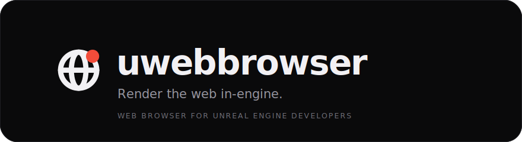

<div align="center">



<br>

**A real browser for Unreal Engine devs.** Tabs, an address bar and real Chrome extensions, wired to the places you actually ship.

[](https://tauri.app)
[](#license)
[](#build)
[](#a-real-browser)

</div>

---

## Why

Every Unreal dev keeps a browser open all day: docs in one tab, Fab in another, your Steam page, the forums, three YouTube tutorials. UWebBrowser is that browser, built around your game instead of a blank new-tab page. Type your game's name once and the dashboard wires itself to Steam, itch.io, Reddit and the rest. Load real web UI straight into your workflow, then get back to the engine.

Open source. Local first. Nothing about your game leaves your machine.

## A real browser

Not a webview wrapper. A native shell running real Chromium tabs, with the parts you expect from Chrome and none of the parts you don't.

- **Real Chrome extensions.** Load unpacked, or click **Add to UWebBrowser** straight from a Chrome Web Store page. Your password manager, your ad blocker, your tools. Pinned to a bar you control.
- **The real inspector.** `F12` opens Chromium DevTools, the actual thing, not a reimplementation.
- **Downloads that behave.** A live progress ring in the top bar and a dropdown panel. Cancel, open, reveal in Explorer.
- **Tabs and an omnibox.** Type a URL to go, type anything else to search. Swap the search engine in Settings.

## Built for shipping a game

- **One-name setup.** Type your game's name. UWebBrowser checks Steam, Epic, Xbox, PlayStation, Nintendo, the App Store, Google Play, itch.io and Twitch, grabs your Steam App ID, and wires the dashboard.
- **All your games.** Track as many titles as you ship. Switch between them on the dashboard.
- **Live Steam numbers.** Players right now, review score, positive %, price. No API key.
- **itch.io stats.** Views, downloads and purchases across your games, with your API key.
- **See your game out there.** Fresh Reddit mentions inline, one-click searches on YouTube, Twitch, TikTok, X and Bluesky.
- **Your work bar.** An editable sidebar of the links you actually use. Seeded with Unreal essentials (docs, Fab, forums, source) plus curated ship, community, assets and news sections. Then fully yours: add, remove, pin.
- **Discover.** A curated catalog of tools, assets, learning channels and communities for Unreal devs at `uwb://discover`. Pin anything to your work bar.

## Get started

Prerequisites: [Rust](https://rustup.rs), [Node.js](https://nodejs.org) 20+, and the WebView2 runtime (ships with Windows 11).

```sh
npm install
npm run tauri dev
```

Build a release:

```sh
npm run tauri build
```

Installers land in `src-tauri/target/release/bundle/`.

Before you push — the same four things CI runs:

```sh
npm run lint
npm run build          # tsc, then vite
npm test               # vitest
cargo test --manifest-path src-tauri/Cargo.toml
```

## Shortcuts

Press `Ctrl+/` in the app for this list. Every one of them works whether the
chrome or the page has focus.

| Keys | Action |
| --- | --- |
| `Ctrl+T` | New tab |
| `Ctrl+W` | Close tab |
| `Ctrl+Shift+T` | Reopen the last closed tab |
| `Ctrl+Tab` / `Ctrl+Shift+Tab` | Next / previous tab |
| `Ctrl+1` … `Ctrl+9` | Jump to tab |
| `Ctrl+L` | Focus address bar |
| `Alt+←` / `Alt+→` | Back / forward |
| `Ctrl+R` · `F5` | Reload |
| `Ctrl+Shift+R` · `Ctrl+F5` | Reload, bypassing the cache |
| `Ctrl+F` | Find on page |
| `Ctrl+D` | Pin to the work bar |
| `F12` · `Ctrl+Shift+I` | DevTools |
| `` Ctrl+` `` | Terminal |
| `Ctrl+J` | Downloads |
| `Ctrl+H` | History |
| `Ctrl+P` | Print |
| `Ctrl+,` | Settings |
| `Ctrl+Shift+Del` | Clear browsing data |
| `Ctrl+/` | Keyboard shortcuts |

## Under the hood

| Layer | What it is |
| --- | --- |
| Core | [Tauri 2](https://tauri.app): a Rust core in one native window |
| UI | React + Vite, rendered in its own webview |
| Tabs | Every tab is its own native WebView2 webview, managed from Rust |
| Extensions | WebView2's native extension API, not a shim |
| Data | Steam, Reddit and itch.io calls run in Rust. No CORS, no proxies |

Extensions and DevTools use WebView2's native layer, so this build is **Windows only**.

## Make a widget

Dashboard tiles and work bar widgets are one spec file each, credited to their creator and shared through the in-app widget shop. The walkthrough, with a copy-paste template, is in [docs/WIDGETS.md](docs/WIDGETS.md).

## Privacy

Your setup (game name, Steam App ID, itch.io API key) is stored locally and never leaves your machine.

## License

MIT

<div align="center">
<br>
<sub><b>uwebbrowser</b> · render the web in-engine</sub>
</div>
